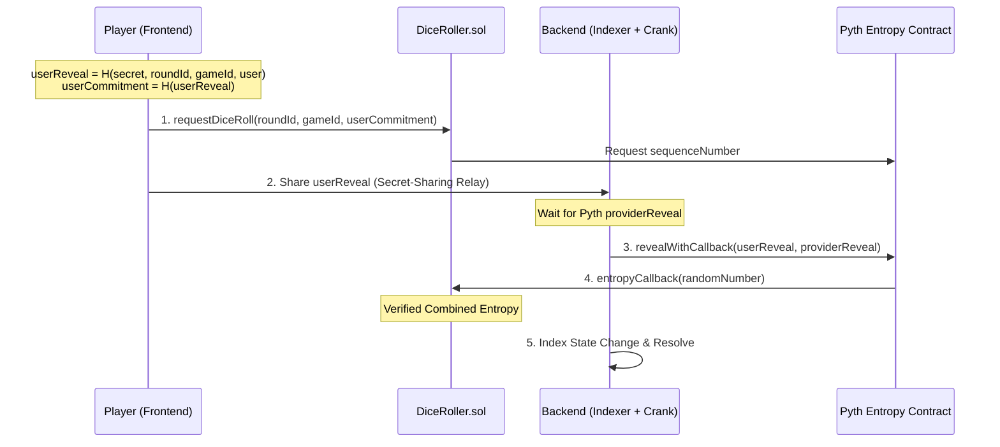

# 🎲 MonkeyHand  (PLEASE IGNORE, Final Deployed Version lacked actual swicthboard or pyth vrf, I had difficulties implmenting it)

A high-stakes multiplayer dice game powered by **Pyth Entropy (VRF) on Monad** for trust-minimal, protocol-hardened on-chain verifiable randomness.

## 🎮 Game Overview

"Last Die Standing" is a card-prediction game where players bet on dice rolls (1-3) using limited cards. The last player with cards remaining wins!

---

## 🔗 Hardened VRF Architecture

This project uses an **Oracle-Native, Trust-Minimal** VRF design with a **Permissionless Reveal, Trust-Minimal Fulfillment** model. Unlike naive implementations, it is hardened against liveness attacks, commitment replays, and MEV.

### System Diagram



### Protocol Security Measures

1.  **Commitment Binding**: Commitments are cryptographically bound to the `roundId`, `gameId`, and the `msg.sender`. This prevents replaying old commitments in new rounds or different games.
2.  **Liveness Fallback**: To prevent a "loser stalls" attack (where a player refuses to reveal a losing result), players share their `userReveal` with the backend indexer after committing. This allows a **Crank Relayer** to finalize the roll autonomously.
3.  **Deterministic Leadership**: Frontend orchestration uses a deterministic leader election (lowest connected player index) to avoid race conditions and redundant transactions.
4.  **Permissionless Completion**: Anyone can call the reveal function if they have the secrets. The outcome is deterministic and trust-minimal; neither the player nor the crank can influence the result.

### Why It's Provably Fair

| Feature | Protection |
|-----------|-------------|
| **Binding** | Prevents Replay Attacks & Context-Mixing |
| **Crank Relay** | Prevents Liveness Dependence & "Griefing" |
| **On-Chain XOR** | Combines Player + Oracle entropy for 100% Fairness |
| **Read-Only Indexer** | Minimizes backend trust requirement |

---

## 🚀 Deployed Contracts (Monad Mainnet)

-   **DiceRoller (Hardened VRF):** [`0x131e56853F087F74Dbd59f7c6581cd57201a5f34`](https://monadexplorer.com/address/0x131e56853F087F74Dbd59f7c6581cd57201a5f34)
-   **Chain ID:** `143` (Monad Mainnet)
-   **Pyth Entropy:** `0x98046Bd286715D3B0BC227Dd7a956b83D8978603`
-   **Pyth Provider:** `0x6CC14824Ea2918f5De5C2f75A9Da968ad4BD6344`

---

## 🛠️ Local Development

### Prerequisites
- Node.js 18+
- Monad Mainnet RPC URL
- `ADMIN_PRIVATE_KEY` (For the Crank Relayer - only needs gas balance)

### Quick Start
```bash
# 1. Start Hardened Indexer + Crank
cd frontend
npm start # (Running server.js)

# 2. Start Frontend UI
cd frontend
npm run dev
```

---

## 📚 Documentation
- [Implementation Summary](docs/implementation_summary.md)
- [Hardened Protocol Walkthrough](walkthrough.md)

---

**Built with ❤️ for Monad Hackathon 2025**
