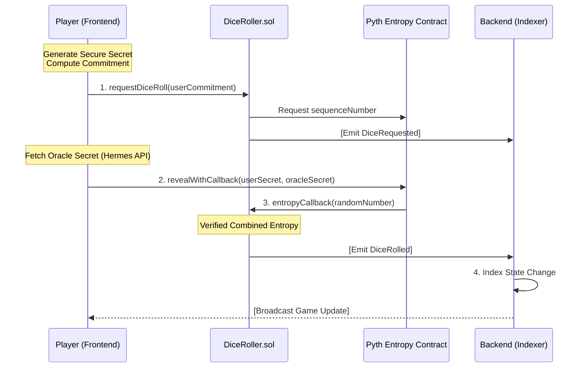

# 🎲 MonkeyHand

A high-stakes multiplayer dice game powered by **Pyth Entropy (VRF) on Monad** for trust-minimal, oracle-native on-chain verifiable randomness.

## 🎮 Game Overview

"Last Die Standing" is a card-prediction game where players bet on dice rolls (1-3) using limited cards. The last player with cards remaining wins!

### How It Works

1. Each player starts with 3 cards (one each of 1, 2, 3).
2. Every round, predict the dice roll by playing a card.
3. **Correct prediction** → Earn credits + Retain card.
4. **Wrong prediction** → Your card burns forever.
5. Run out of cards → You're eliminated.
6. Last player standing wins!

---

## 🔗 Pyth Entropy VRF Architecture

This project uses an **Oracle-Native, Trust-Minimal** VRF design. Unlike traditional implementations, the backend server holds no private keys and cannot influence the result. Every player creates their own secret entropy, which is combined with Pyth's entropy on-chain.

### System Diagram



### The Oracle-Native Flow

1.  **Commit:** The Player's browser generates 32 bytes of secure random entropy (`userSecret`) and submits its hash (`userCommitment`) to the blockchain.
2.  **Fetch:** The Player fetches the matching Pyth provider's secret (revealed only after the commitment is confirmed) via the Pyth Hermes API.
3.  **Reveal:** The Player submits both their `userSecret` and the `oracleSecret` to the Pyth Entropy contract. 
4.  **Callback:** Pyth verifies the secrets match their respective commitments, XORs them together, and calls `DiceRoller.entropyCallback` with the final random result.
5.  **Index:** The Backend (acting ONLY as a read-only observer) records the event and updates the UI for other players.

### Why It's Provably Fair

| Component | Trust Level | Role |
|-----------|-------------|------|
| **Backend** | ❌ None | **Read-Only Indexer**. No keys. No writes. |
| **Contract** | 🔒 Authority | Verifies cryptographic proofs on-chain. |
| **Player** | 🔑 Secret Owner | Contributes half of the entropy source. |
| **Pyth** | 📡 Oracle | Provides the other half of the entropy source. |

**No party can predict or manipulate the result alone.** The outcome is unknown until both secrets are revealed on-chain.

---

## 🚀 Deployed Contracts (Monad Mainnet)

-   **DiceRoller (Pyth VRF):** [`0x131e56853F087F74Dbd59f7c6581cd57201a5f34`](https://monadexplorer.com/address/0x131e56853F087F74Dbd59f7c6581cd57201a5f34)
-   **Chain ID:** `143` (Monad Mainnet)
-   **Pyth Entropy:** `0x98046Bd286715D3B0BC227Dd7a956b83D8978603`
-   **Pyth Provider:** `0x6CC14824Ea2918f5De5C2f75A9Da968ad4BD6344`

---

## 💻 Tech Stack

-   **Blockchain:** Monad Mainnet (Parallel EVM)
-   **Oracle:** Pyth Entropy (Commit-Reveal VRF)
-   **Auth:** Privy (Social & Embedded Wallets)
-   **Backend:** Node.js (Read-only event indexer)
-   **Frontend:** React + Vite + Viem
-   **Design:** Balatro-inspired "Vibrant Glitch" Aesthetic

---

## 🎯 Key Features

✅ **Trust-Minimal Architecture** - Server cannot re-roll or manipulate results.  
✅ **Oracle-Native Flow** - Transactions are handled by players and Pyth directly.  
✅ **Monad Optimized** - High-speed randomness for rapid gameplay.  
✅ **Verifiable Fairness** - Every roll is a cryptographic combination of two secrets.  
✅ **Arcade UI** - Fluid animations, CRT filters, and dynamic dice physics.

---

## 🛠️ Local Development

### Prerequisites
- Node.js 18+
- Monad Mainnet RPC URL
- A browser wallet (e.g., MetaMask) on Monad Mainnet

### Quick Start
```bash
# 1. Start Read-Only Indexer
cd oracle-backend
npm install
npm start

# 2. Start Frontend
cd frontend
npm install
npm run dev
```

---

## 📚 Documentation
- [Deployment Guide](DEPLOYMENT.md)
- [Architecture Walkthrough](docs/implementation_summary.md)
- [Trust Model Details](docs/security_review.md)

---

**Built with ❤️ for Monad Hackathon 2025**
