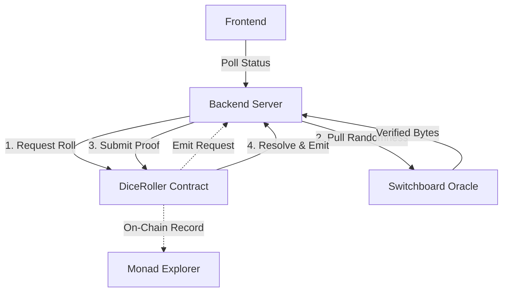

# 🎲 MonkeyHand

A high-stakes multiplayer dice game powered by **Switchboard VRF on Monad** for provably fair, on-chain verifiable randomness.

## 🎮 Game Overview

"Last Die Standing" is a card-prediction game where players bet on dice rolls (1-3) using limited cards. The last player with cards remaining wins!

### How It Works

1. Each player starts with 3 cards (one each of 1, 2, 3).
2. Every round, predict the dice roll by playing a card.
3. **Correct prediction** → Earn credits + Retain card.
4. **Wrong prediction** → Your card burns forever.
5. Run out of cards → You're eliminated.
6. Last player standing wins!

---

## 🔗 Switchboard VRF Architecture

Integrating Switchboard's **On-Demand (Pull-based)** model to ensure that the backend cannot manipulate dice rolls.

### System Diagram



### The "Pull-Based" Flow
Unlike legacy callback models, the **Switchboard On-Demand** flow on Monad follows a secure Request-Submit pattern:

1.  **Request:** The Backend triggers `requestDiceRoll(roundId)` on-chain.
2.  **Pull:** The Backend (acting as the Relayer) fetches cryptographically verified randomness from the Switchboard TEE-verified Oracle.
3.  **Submit:** The Backend submits this verified proof to the `submitVerifiedRoll` function.
4.  **Verify:** The `DiceRoller` contract validates the proof and calculates the result (1-3) **on-chain**.
5.  **Audit:** Every roll is permanently recorded on the Monad blockchain, providing a transparent audit trail.

### Trust Model

| Component | Can Manipulate Result? | Role |
|-----------|------------------------|------|
| **Backend** | ❌ No | Relayer (Cannot alter the proof) |
| **Contract** | ❌ No | Judge (Calculates result on-chain) |
| **Switchboard** | ✅ Trusted Source | TEE-Verified Oracle (Industry Standard) |
| **Frontend** | ❌ No | Display (Verifies via Explorer) |

---

## 🚀 Deployed Contracts (Monad Mainnet)

-   **DiceRoller:** [`0x466b833b1f3cD50A14bC34D68fAD6be996DC74Ea`](https://monadvision.com/address/0x466b833b1f3cD50A14bC34D68fAD6be996DC74Ea)
-   **Chain ID:** `143` (Monad Mainnet)
-   **Switchboard Oracle:** `0x33A5066f65f66161bEb3f827A3e40fce7d7A2e6C`

---

## 💻 Tech Stack

-   **Blockchain:** Monad Mainnet (Scalable EVM)
-   **Oracle:** Switchboard On-Demand VRF (TEE-Verified)
-   **Auth:** Privy (Twitter/Social login)
-   **Backend:** Node.js + Viem
-   **Frontend:** React + Vite + Styled Components
-   **Persistence:** Redis / Vercel KV

---

## 🛠️ Local Development

### Prerequisites
- Node.js 18+
- Monad Mainnet RPC URL
- Funded Backend Wallet (MON for gas)

### Quick Start
```bash
# 1. Install dependencies
cd frontend
npm install

# 2. Setup Environment
cp .env.example .env
# Update DICEROLLER_ADDRESS and ADMIN_PRIVATE_KEY

# 3. Start Backend
npm run server

# 4. Start Frontend
npm run dev
```

### Testing & Verification
```bash
# Run API Health & Game Logic Tests (25/25 Passing)
node test.js

# Trigger a Real On-Chain Dice Roll Test
node roll-dice.js
```

---

## 🎯 Key Features

✅ **Provably Fair** - Switchboard TEE-verified randomness source.  
✅ **On-Chain Settlement** - Results are calculated and recorded on Monad.  
✅ **Verifiable History** - Every roll links directly to a Monad Explorer transaction.  
✅ **Social Boarding** - Seamless entry with Twitter via Privy.  
✅ **Arcade UI** - Fluid, responsive animations for an immersive experience.

---

## 🏆 Leaderboard & Stats
The global leaderboard tracks player performance across all matches:
- **Win Rate %** (Standardized ranking)
- **Total Wins**
- **First Blood** (Earliest correct prediction in match history)

---

## 📚 Documentation
- [Architecture Details](docs/implementation_summary.md)
- [Testing Guide](frontend/TESTING.md)
- [Local Setup Guide](frontend/LOCAL_SETUP.md)

---

**Built with ❤️ for Monad Hackathon 2025**
