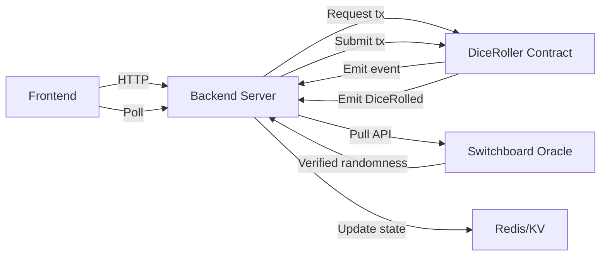

# 🎲 Last Die Standing

A high-stakes multiplayer dice game powered by **Switchboard VRF on Monad** for provably fair randomness.

## 🎮 Game Overview

"Last Die Standing" is a card-prediction game where players bet on dice rolls (1-3) using limited cards. The last player with cards remaining wins!

### How It Works

1. Each player starts with 3 cards (one each of 1, 2, 3)
2. Every round, predict the dice roll by playing a card
3. **Correct prediction** → Earn credits
4. **Wrong prediction** → Your card burns forever
5. Run out of cards → You're eliminated
6. Last player standing wins!

---

## 🔗 Switchboard VRF Architecture

### System Diagram



### Flow

1. **Request** - Backend triggers `requestDiceRoll()` on Monad
2. **Fetch** - Backend retrieves verified randomness from Switchboard Oracle
3. **Submit** - Backend submits to `submitVerifiedRoll()` on contract
4. **Verify** - Contract validates and emits `DiceRolled` with proof
5. **Display** - Frontend shows result + Monad Explorer verification link

### Trust Model

| Component | Can Manipulate Result? | Why |
|-----------|------------------------|-----|
| Backend | ❌ No | Can only relay Switchboard's randomness |
| Contract | ❌ No | Validates and stores verified randomness |
| Switchboard | ✅ Trusted | TEE-based oracle (industry standard) |
| Frontend | ❌ No | Read-only display |

**Verification:** Every roll includes a transaction hash linking to [Monad Explorer](https://monadvision.com), allowing players to verify the on-chain proof.

---

## 🚀 Deployed Contracts

- **DiceRoller:** `0x466b833b1f3cD50A14bC34D68fAD6be996DC74Ea` (Monad Mainnet)
- **Switchboard Oracle:** `0x33A5066f65f66161bEb3f827A3e40fce7d7A2e6C`

---

## 💻 Tech Stack

### Frontend
- React + Vite
- Privy (Social auth via Twitter)
- Wagmi + Viem (Blockchain)
- Monad Mainnet

### Backend
- Express.js
- Viem (Contract interaction)
- Redis/Vercel KV (State persistence)

### Smart Contracts
- Solidity 0.8.24
- Hardhat
- Switchboard On-Demand VRF

---

## 🛠️ Local Development

### Prerequisites

- Node.js 18+
- Monad Mainnet RPC access
- Private key for backend wallet (small MON for gas)

### Quick Start

```bash
# Install dependencies
cd frontend
npm install

# Configure environment
cp .env.example .env
# Add: ADMIN_PRIVATE_KEY, DICEROLLER_ADDRESS

# Terminal 1: Start backend
npm run server

# Terminal 2: Start frontend
npm run dev
```

### Testing

```bash
# Test all API endpoints
node test.js

# Test on-chain dice roll
node roll-dice.js
```

See [LOCAL_SETUP.md](frontend/LOCAL_SETUP.md) for detailed instructions.

---

## 📦 Contract Deployment

### Deploy DiceRoller to Monad Mainnet

```bash
cd contracts

# Install dependencies
npm install

# Configure .env
echo "PRIVATE_KEY=your_deployer_private_key" > .env

# Deploy contract
npx hardhat run scripts/deploy_switchboard.js --network monadMainnet
```

**Expected Output:**
```
🎲 DiceRoller deployed to: 0x...
   Owner: 0x...
```

**After Deployment:**
1. Copy the contract address
2. Update `frontend/.env`:
   ```
   DICEROLLER_ADDRESS=0x...
   ADMIN_PRIVATE_KEY=your_backend_wallet_key
   ```
3. Restart backend server

---

## 🎯 Key Features

✅ **Provably Fair** - Switchboard TEE-verified randomness  
✅ **On-Chain Verification** - Every roll has blockchain proof  
✅ **Real-Time Multiplayer** - Live game state synchronization  
✅ **Social Login** - Twitter auth via Privy  
✅ **Leaderboard** - Track wins and win rates  
✅ **Mobile Responsive** - Play anywhere

---

## 🏆 Leaderboard

Every game updates the global leaderboard with:
- Games played
- Games won  
- Win percentage

Top 50 players ranked by win rate!

---

## 📚 Documentation

- [Local Setup Guide](frontend/LOCAL_SETUP.md) - Development environment
- [Testing Guide](frontend/TESTING.md) - API & VRF tests
- [Deployment Guide](DEPLOYMENT.md) - Vercel production setup
- [Implementation Summary](docs/implementation_summary.md) - Architecture details

---

## 🎲 Game Rules

- **Players**: 2-4 players
- **Starting Cards**: Each player has cards [1, 2, 3]
- **Round Flow**:
  - **Commit Phase** (25s): Select a card or skip
  - **Rolling**: On-chain dice roll (1-3)
  - **Resolve** (5s): See results, wrong cards burn
- **Win Condition**: Last player with cards OR highest credits after 5 rounds
- **Tie-breakers**: Most cards → Earliest correct prediction

---

## 🔐 Security

- All randomness verifiable on-chain via Monad Explorer
- Backend wallet isolated (gas-only funds)
- Environment variables for sensitive data
- No player funds held in contracts
- Open-source contract code

---

## 📄 License

MIT

---

**Built with ❤️ for Monad Hackathon 2025**
