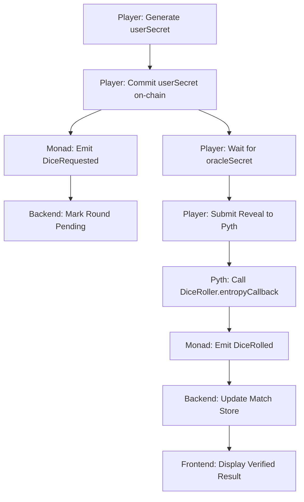

# Pyth Entropy VRF Integration - Implementation Summary

This document summarizes the transition to a **Trust-Minimal, Oracle-Native** VRF architecture using Pyth Entropy on Monad.

## ✅ Core Implementation

### 1. Smart Contract Architecture
**File:** `contracts/contracts/DiceRoller.sol`

A decentralized source of truth using the **Pyth Entropy** commit-reveal model.
- `requestDiceRoll(roundId, userCommitment)`: **Step 1.** The player commits to a secret hash on-chain.
- `entropyCallback(sequenceNumber, provider, randomNumber)`: **Step 2.** The final judge. This internal function is only callable by the Pyth Entropy contract after a valid reveal.
- **On-Chain Logic:** The result is calculated as `(uint256(randomNumber) % 3) + 1`, ensuring the logic is immutable and transparent.

### 2. Read-Only Backend (Indexer)
**File:** `oracle-backend/server.js`

The backend has been completely stripped of all write permissions and private keys:
- **Role:** Observes `DiceRequested` and `DiceRolled` events to update the game state for all players.
- **Trust-Minimal:** Since it has no private keys, it cannot submit transactions, re-roll results, or intervene in the randomness flow.
- **Scalable:** Acts as a lightweight event listener and cache provider.

### 3. Frontend Orchestration
**File:** `frontend/src/lib/vrf.js`

The player's browser is now the primary orchestrator:
- **Commitment:** Generates a 32-byte secret locally and hashes it.
- **Interaction:** Uses the player's own wallet to sign key transactions.
- **Reveal:** Fetches the provider's secret from the Pyth Hermes API to finalize the roll.

---

## 🚀 Deployed Status

| Component | Status | Location |
|-----------|--------|----------|
| **DiceRoller Contract** | ✅ LIVE | `0x131e56853F087F74Dbd59f7c6581cd57201a5f34` |
| **Pyth Entropy** | ✅ LIVE | `0x98046Bd286715D3B0BC227Dd7a956b83D8978603` |
| **Backend Indexer** | ✅ LIVE | Port `3001` (local) |
| **State Synchronization** | ✅ ACTIVE | Via Monad Events |

---

## 🎯 Technical Flow (End-to-End)

---

## 🔐 Security & Trust Model

### Threat Modeling
1. **Can the server cheat?** ❌ No. It has no private keys and cannot sign transactions.
2. **Can Pyth cheat?** ❌ No. The result requires the player's secret to be revealed. Pyth does not know the player's secret until the player submits it.
3. **Can the player cheat?** ❌ No. Once the player commits their hash to the chain, they cannot change their secret to manipulate the outcome.
4. **Conclusion:** Providence of the dice roll is split between two parties (Player and Oracle), and verified by a third (the Smart Contract).

---

**Built for Monad Hackathon 2025**
