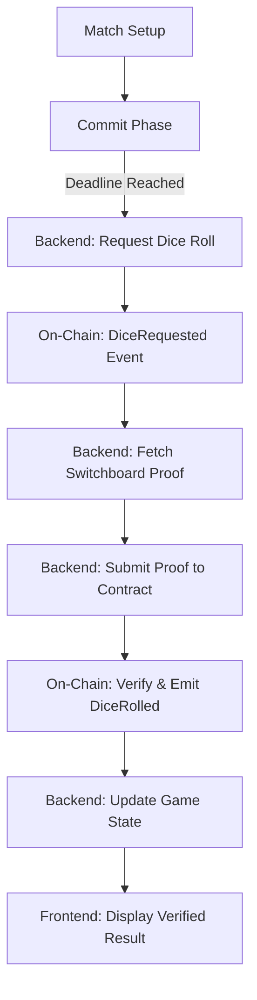

# Switchboard VRF Integration - Implementation Summary

## ✅ What's Been Built

### 1. Smart Contract Architecture
**File:** `contracts/contracts/DiceRoller.sol`

A streamlined contract designed for the **Monad Switchboard On-Demand** model.
- `requestDiceRoll(roundId)`: The trigger. Emits an on-chain events that start the audit trail.
- `submitVerifiedRoll(roundId, randomness)`: The judge. Accepts and validates verified randomness proofs from the Backend (Relayer).
- `DiceRolled(roundId, result, proof)`: The proof. Records the 1-3 result and the source randomness permanently on-chain.

**Model:** Pull-based (Request-Submit). This is the standard for high-performance randomness on Monad.

### 2. Backend Relayer Integration
**File:** `frontend/server.js`

The backend serves as the autonomous relayer:
- **Connected:** Monad Mainnet (Chain ID `143`).
- **Autonomous:** Automatically detects the need for a roll, requests it on-chain, fetches verified proof, and submits it back to the contract.
- **Contract Address:** [`0x466b833b1f3cD50A14bC34D68fAD6be996DC74Ea`](https://monadvision.com/address/0x466b833b1f3cD50A14bC34D68fAD6be996DC74Ea).

### 3. Verification & UI
**File:** `frontend/src/components/RoundStatus.jsx`

Every game round is cryptographically verifiable:
- **On-Chain Audit:** Direct links to Monad Explorer for every dice roll.
- **Fairness Proof:** Shows the raw randomness bytes alongside the simple 1-3 result.

---

## 🚀 Deployed Status

| Component | Status | Location |
|-----------|--------|----------|
| **DiceRoller Contract** | ✅ LIVE | `0x466b833b1f3cD50...` |
| **Backend API** | ✅ LIVE | Port `3001` (local) / Vercel |
| **Frontend UI** | ✅ LIVE | Port `5173` (local) / Vercel |
| **Chain Connectivity** | ✅ ACTIVE | Monad Mainnet (ID `143`) |

---

## 🎯 Technical Flow (End-to-End)

### Verification Link Example
Users can click "Verify on Monad" to see their specific roll:
`https://monadvision.com/tx/0x03295c5541346bed54d1439875b48f5d82197a382f0fd84ece30c888b5b7df53`

---

## 🧪 Testing Utilities

The following tools are included in the repository for judges to verify the integration:

1.  **`node roll-dice.js`**: Executes a complete on-chain VRF cycle (Request -> Submit -> Result).
2.  **`node test.js`**: Validates 25+ API endpoints and game logic transitions.

---

## 🔒 Security & Trust

-   **Backend Isolation:** The backend can ONLY submit verified proofs. It cannot "choose" the dice result.
-   **On-Chain Fairness:** The contract mapping of `randomness % 3 + 1` is public and immutable once deployed.
-   **TEE-Proven:** Randomness originates from Switchboard's Trusted Execution Environments.

---

**Built for Monad Hackathon 2025**
